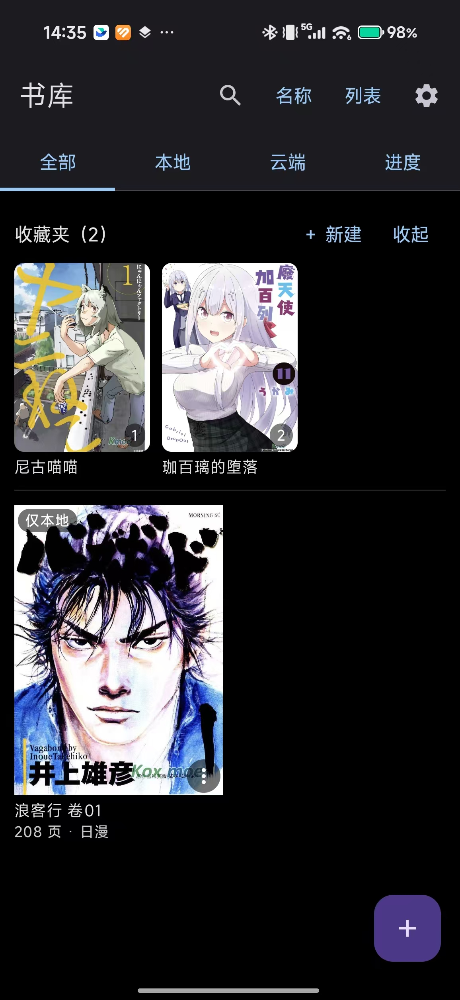
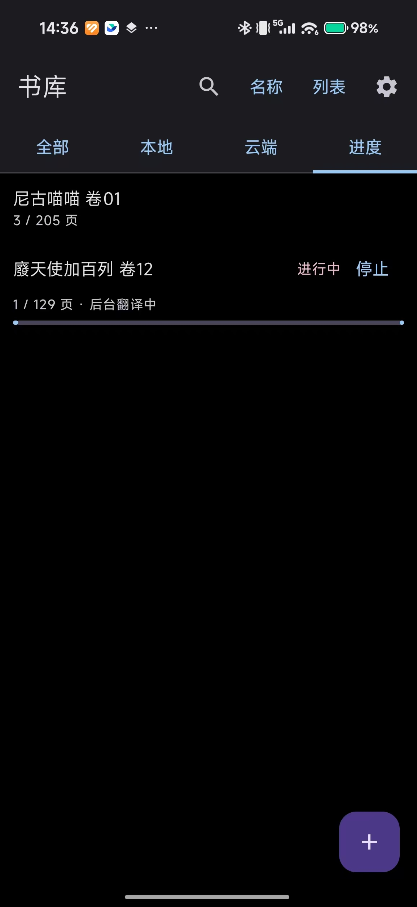
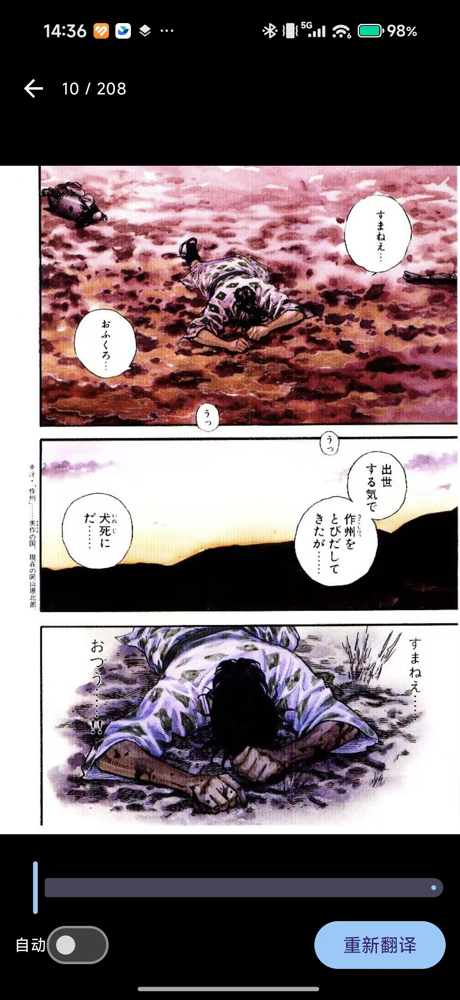

# Manga Image Translator · 漫画翻译

> 把生肉漫画丢进手机，一键变成熟肉。**Android 漫画阅读器 App** + GPU 翻译引擎 + FastAPI 后端 + 云端同步，全部自己部署。

[](https://github.com/Dovahlore/manga-image-translator/releases)
[](LICENSE)
[](#)

本仓库 Fork 自 [zyddnys/manga-image-translator](https://github.com/zyddnys/manga-image-translator)，保留其检测 / OCR / 抹字 / 嵌字引擎，并在外面加了一整套**能直接拿来用的手机端**：阅读器 App、后端服务层、账号隔离与云同步。

---

## 它能做什么

导入一本漫画 → 后台自动一页页翻译 → 翻页时直接看到中文，原文随时可切回。译文与阅读进度都存在你自己的服务器上，换手机也能接着看。

- **不占手机算力**：翻译跑在家里的 N 卡上，App 只负责展示
- **数据在自己手里**：后端、数据库、缓存、书页文件全部落在项目目录内
- **一个 API Key 一个书架**：多账号数据完全隔离

## 截图

<p align="center">
  
  
  
  
</p>

<p align="center">
  <sub>书库（网格 + 收藏夹 + 状态角标） · 进度（后台翻译） · 原文（日文） · 译文（中文）</sub>
</p>

## 功能特性

### 📖 阅读器

- 导入 **EPUB / MOBI / AZW**，自动解析封面与页数
- 单页翻译、自动预翻、**全书翻译**（后台跑，可断点续传，可随时停止）
- 翻到哪页直接显示已翻译结果，**不闪原图**
- 手势：双指捏合缩放、双击放大、单指拖拽 1:1 跟手、边缘滑动翻页、跳页滑块
- 单击切换 **译文 / 原图**，点空白区域唤出 UI
- 阅读进度记忆、「继续阅读」直达上次位置
- 译文图 **WebP 无损压缩**，省流量不降质

### 📚 书库管理

- 四个标签页：**全部 / 本地 / 云端 / 进度**
- **网格 / 列表** 双视图一键切换，宽度自适应屏幕
- 排序：名称 / 最近阅读 / 创建时间
- 收藏夹分组，支持展开收起（网格=首行、列表=三个）与批量移动
- 状态角标一眼分辨：`仅本地` / `仅云端 ☁` / `已同步 ☁✓`
- 后台翻译进度直接显示在书籍卡片上，不用进详情页
- 导入自动去重（内容 hash + 指纹），同一本书不会重复入库

### ☁️ 云端同步

- 整本漫画打包上传到自己的服务器，重装 / 换机后一键还原
- 云端书可单独下载原文件，收藏夹结构一起同步
- **取消同步 = 删除云端副本**，本地文件不受影响
- **已同步的书再翻译不用重复传图**：服务端直接从云端 zip 取页翻译
- 删除书籍 / 取消同步会同步**停掉正在跑的翻译任务**，不留孤儿任务
- 未同步的翻译结果保留 **14 天**后自动清理；已同步的**永久保留**

### 🖥 服务端

- **app_api**（FastAPI）：书页管理、任务队列、进度上报、缓存命中
- **MySQL**：`users` / `books` / `pages` / `page_blocks` / `page_context` / `jobs` / `cloud_folders`，外键级联删除
- **Redis**：翻译结果缓存，同一张图秒回
- **API Key 即账号**：`MIT_API_TOKEN` 支持逗号分隔多 Key，各自独立书架
- **内网穿透**：本机 `frpc` → 你的 VPS `frps` → 你的域名，出门也能用

## 架构

```
Android App (Kotlin / Compose)
   │  HTTP —— 局域网 http://<本机IP>:8020 / 或走 frp 公网域名
   ▼
app_api (FastAPI, :8020)
   │  ├── MySQL   书页 / 任务 / 用户 / 云端索引
   │  ├── Redis   翻译结果缓存
   │  └── 本地磁盘 原图 + 译文 + 云端 zip（都在 _runtime/ 内）
   ▼
engine (FastAPI, :8010, GPU)
   └── 模型：检测 / OCR / 抹字 / 嵌字（约 4.8GB）
```

## 快速开始

### 1. 起后端（引擎 + 接口 + 数据库）

```bash
cp app.env.example app.env        # 填自己的数据库密码和 MIT_API_TOKEN
echo "DEEPSEEK_API_KEY=sk-xxxx" > secret.env   # 翻译用的大模型 Key
docker compose --env-file app.env -f docker-compose.full.yml up -d
```

首次会拉取约 4.8GB 模型，需要一张 N 卡。所有运行期数据都在项目内的 `_runtime/`。

### 2. 装 App

- 直接下载 [Release APK](https://github.com/Dovahlore/manga-image-translator/releases) 安装；
- 或自行打包：`cd android && ./gradlew assembleRelease`（需要 `android/app/keystore.properties`）。

打开 App → **设置** → 服务器地址填 `http://<本机IP>:8020`，API Key 填 `app.env` 里的 `MIT_API_TOKEN`。

### 3. （可选）内网穿透

见 [docker/tunnel/README.md](docker/tunnel/README.md)：本机 `frpc` → 你的 VPS `frps` → 你的域名。

```bash
docker compose --env-file app.env \
  -f docker-compose.full.yml -f docker-compose.tunnel.yml up -d
```

## 目录

```
android/                    Android App（Kotlin / Compose）
app_api/                    FastAPI 后端（书页 / 任务 / 云同步）
server/                     引擎 HTTP 服务（继承自上游）
docker-compose.full.yml     引擎 + app-api + MySQL + Redis
docker-compose.tunnel.yml   frp 内网穿透（可选）
docker/tunnel/              穿透配置与文档
docs/screenshots/           README 截图
```

## 文档

- [app_api/API.md](app_api/API.md) —— 后端接口说明
- [docs/postman/](docs/postman/) —— Postman 集合，可直接导入调试
- [DOCKER_SETUP.md](DOCKER_SETUP.md) —— 部署细节
- [android/README.md](android/README.md) —— App 构建说明

## Fork 来源

基于 [zyddnys/manga-image-translator](https://github.com/zyddnys/manga-image-translator)（GPL-3.0）。翻译引擎、检测 / OCR / 抹字 / 嵌字模型均来自上游；本 Fork 新增 Android App、后端服务层与云同步。
